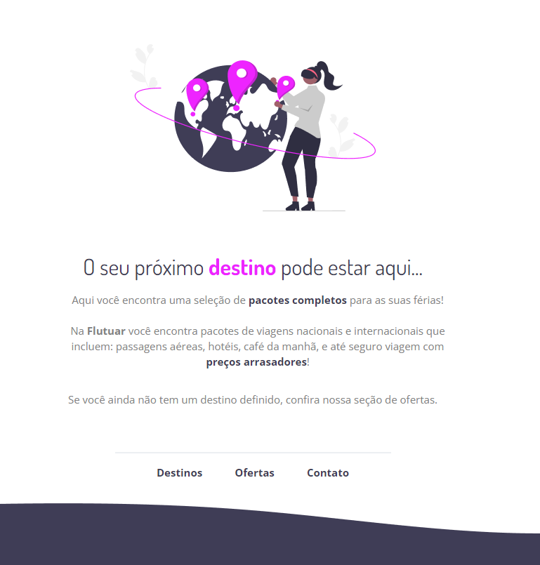

# rocketseat-explorerS02-flutuar
Página criada como exercício desafio do stage 02 do curso Explorer da rocketseat

## 🚀 Tecnologias
Esse projeto foi desenvolvido com as seguintes tecnologias:

- HTML e CSS
- Git e Github
- Figma

## Preview

  

